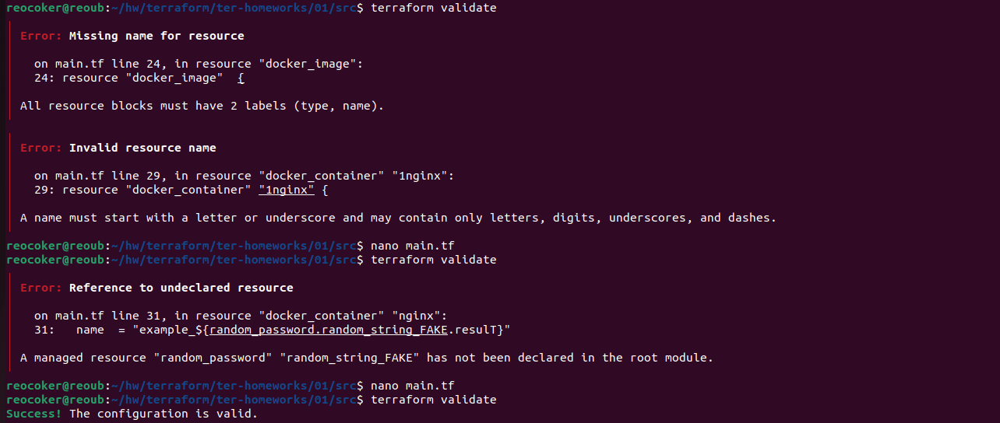
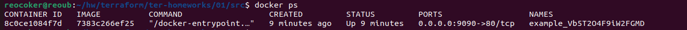
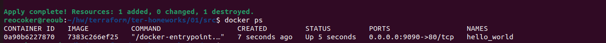
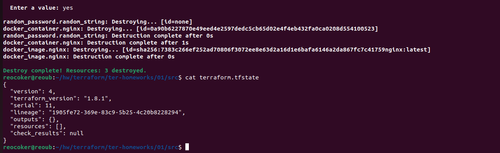
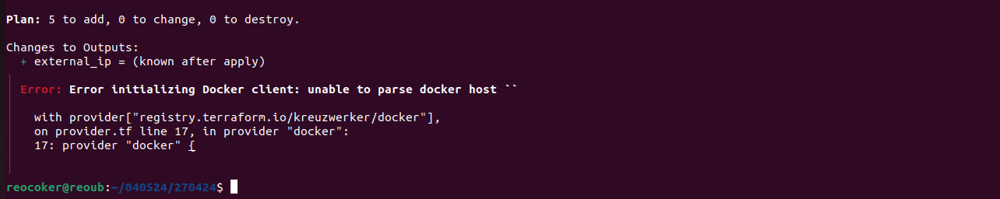
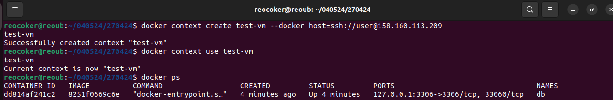
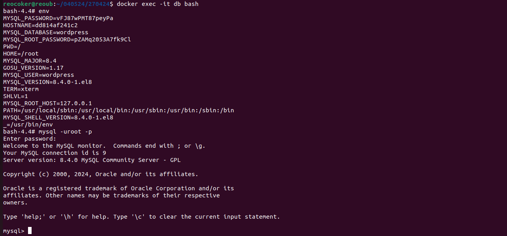
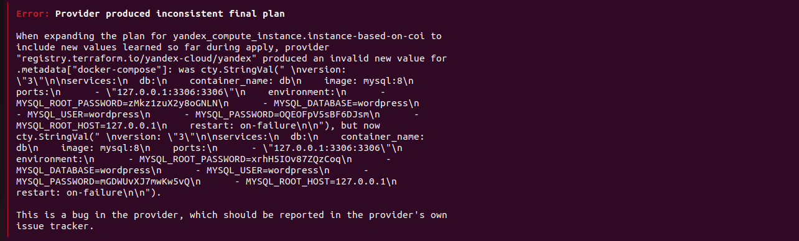
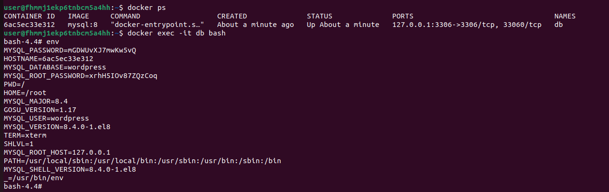

# Домашнее задание к занятию «Введение в Terraform»

------

### Задание 1

1. Перейдите в каталог [**src**](https://github.com/netology-code/ter-homeworks/tree/main/01/src). Скачайте все необходимые зависимости, использованные в проекте. 
2. Изучите файл **.gitignore**. В каком terraform-файле, согласно этому .gitignore, допустимо сохранить личную, секретную информацию?
3. Выполните код проекта. Найдите  в state-файле секретное содержимое созданного ресурса **random_password**, пришлите в качестве ответа конкретный ключ и его значение.
4. Раскомментируйте блок кода, примерно расположенный на строчках 29–42 файла **main.tf**.
Выполните команду ```terraform validate```. Объясните, в чём заключаются намеренно допущенные ошибки. Исправьте их.
5. Выполните код. В качестве ответа приложите: исправленный фрагмент кода и вывод команды ```docker ps```.
6. Замените имя docker-контейнера в блоке кода на ```hello_world```. Не перепутайте имя контейнера и имя образа. Мы всё ещё продолжаем использовать name = "nginx:latest". Выполните команду ```terraform apply -auto-approve```.
Объясните своими словами, в чём может быть опасность применения ключа  ```-auto-approve```. Догадайтесь или нагуглите зачем может пригодиться данный ключ? В качестве ответа дополнительно приложите вывод команды ```docker ps```.
8. Уничтожьте созданные ресурсы с помощью **terraform**. Убедитесь, что все ресурсы удалены. Приложите содержимое файла **terraform.tfstate**. 
9. Объясните, почему при этом не был удалён docker-образ **nginx:latest**. Ответ **ОБЯЗАТЕЛЬНО НАЙДИТЕ В ПРЕДОСТАВЛЕННОМ КОДЕ**, а затем **ОБЯЗАТЕЛЬНО ПОДКРЕПИТЕ** строчкой из документации [**terraform провайдера docker**](https://docs.comcloud.xyz/providers/kreuzwerker/docker/latest/docs).  (ищите в классификаторе resource docker_image )


### Решение 1


2. Согласно  .gitignore, допустимо сохранить личную, секретную информацию в файле personal.auto.tfvars.

3. "result": "Vb5T2O4F9iW2FGMD".
   
4. 1-ая ошибка - блок ресурса должен иметь 2 метки - тип и имя , здесь только имя.
   
   2-ая ошибка - метка имени должна начинаться с буквы , здесь с цифры.
   
   3-ая ошибка - данный ресурс не был описан в манифесте ( ошибка в названии ).
   
   

   
5. Исправленный фрагмент кода:
   
```HCL
resource "docker_image" "nginx"  {
  name         = "nginx:latest"
  keep_locally = true
}

resource "docker_container" "nginx" {
  image = docker_image.nginx.image_id
  name  = "example_${random_password.random_string.result}"

  ports {
    internal = 80
    external = 9090
  }
}
```



6.Опасность применения ключа  ```-auto-approve``` заключается в том, что изменения производятся сразу без потверждения. Человеческий фактор или банальная опечатка могут привести к плачевному результату. 
Использовать данный ключ можно при автоматизации процесса , но нужно быть 100% уверенным в корректности данных.




7. Содержимое файла **terraform.tfstate** после уничтожения ресурсов:



8. Docker-образ **nginx:latest** не был удален , так как в предаствленном коде использовался аргумент keep_locally = true

Строчка из документации:
keep_locally (Boolean) If true, then the Docker image won't be deleted on destroy operation. If this is false, it will delete the image from the docker local storage on destroy operation.

------


### Задание 2*

1. Создайте в облаке ВМ. Сделайте это через web-консоль, чтобы не слить по незнанию токен от облака в github(это тема следующей лекции). Если хотите - попробуйте сделать это через terraform, прочитав документацию yandex cloud. Используйте файл ```personal.auto.tfvars``` и гитигнор или иной, безопасный способ передачи токена!
2. Подключитесь к ВМ по ssh и установите стек docker.
3. Найдите в документации docker provider способ настроить подключение terraform на вашей рабочей станции к remote docker context вашей ВМ через ssh.
4. Используя terraform и  remote docker context, скачайте и запустите на вашей ВМ контейнер ```mysql:8``` на порту ```127.0.0.1:3306```, передайте ENV-переменные. Сгенерируйте разные пароли через random_password и передайте их в контейнер, используя интерполяцию из примера с nginx.(```name  = "example_${random_password.random_string.result}"```  , двойные кавычки и фигурные скобки обязательны!) 
```
    environment:
      - "MYSQL_ROOT_PASSWORD=${...}"
      - MYSQL_DATABASE=wordpress
      - MYSQL_USER=wordpress
      - "MYSQL_PASSWORD=${...}"
      - MYSQL_ROOT_HOST="%"
```

6. Зайдите на вашу ВМ , подключитесь к контейнеру и проверьте наличие секретных env-переменных с помощью команды ```env```. Запишите ваш финальный код в репозиторий.

### Решение 2*
Пытался полностью автоматизировать процесс [main.tf](./var1/main.tf) , но что-то не срослось.
Сначала пытался на образ с предустановленным docker накатить провайдер docker.Но получал ошибку. 

Обойти ее используя depends_on не смог. Единственный вариант - закоментировать блоки связанные с образом и контейнером. А после разворачивания вм , раскомментировать и повторно apply все работает.



Решил зайти с другой стороны, [main.tf](./var2/main.tf) тут ,правда, пришлось еще и нагромоздить [main.tf](./var1/template.tf). 
С первого раза выдает ошибку

Но при вторичном apply , все работает как часы :



------

